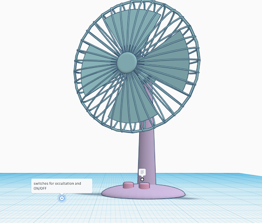

# Home

(Project Name)

**Team 208**
* Joaquin Jimenez
* Enyinnaya Onyenso
* Abner Oaxaca
* Panagiotis Levendis

**Created:** 01/19/2024

**University:** Arizona State University 

**Course:** EGR-314 

**Professor:** Travis Kelly

- [Introduction](#introduction)
- [Team Organization](#team-organization)
- [User Needs, Benchmarking, and Requirements](#user-needs--benchmarking--and-requirements)
- [Design Ideation](#design-ideation)
- [Appendix](#appendix)
  * [Team organization](#team-organization-1)
  * [Ordered User Needs and Benchmarking:](#ordered-user-needs-and-benchmarking-)
  * [PRD](#prd)
  * [Design Ideation](#design-ideation-1)

## Team Organization

### Charter

Our team aims to influence how the weather forecast influence people's lives. We aim to achieve this by developing a user-friendly, eco-friendly and hands-free device that can detect and predict, based off past patterns, weather phenomenon.

### Mission Statement

Our product is dedicated to providing reliable, real-time weather information in a user-friendly manner, empowering individuals and communities for informed decision-making in various fields. Through innovative and eco-friendly technology, we aim to enhance accessibility to crucial weather insights, promoting safety, efficiency, and a deeper understanding of the natural environment, ultimately making a positive impact on the world.

## User Needs, Benchmarking, and Requirements

We identified our user needs by conducting research on products that are on the market. By combing through the pages of reviews, five stars to one star, we were able to distill what the user was looking for in a mobile weather station. Our team specifically picked out smart fans and anemometers as a market to pursue and from what we gathered, the user needs were apparent. By going through the reviews of popular and unpopular wind devices, we identified sore spots or highlights the consumer continuously pointed out in their reviews. We took these pain points and praises, separated out the fluff and kept what was relevant to us, dividing this data up into two categories, Latent and Explicit. Explicit being more easily identifiable pain points and Latent being points that are more difficult to pin down as to why they're frustrating. We then took these points and turned them into specifications from where our product can draw its strengths from. To ensure these specifications our design will revolve around we will constantly be referring to our list of product requirements to make sure we incorporate them in our product. Our product requirements list is our most purest form of user needs that relate specifically to our device and with this list we can asses our device according to it. Some standout requirements included the device should withstand extreme heat and cold temperatures, the device is made from durable material, the device should include an emergency switch and the device should have intuitive user control. The focus of our project is in creating a device capable of reading wind speed and temperature and using the information to heat or cool the room. For the full list of product requirements and user needs they can be found in the appendix.

## Design Ideation

Every team member played the key role in the design process, we each came up with a list of ideas for a design concept which was bounced around. We used a couple of different brainstorming methods including mind mapping, figure storming, rapid ideation and analyzing customer reviews. Everyone was able to pitch their ideas and we voted on which would be the best device for our group and the projects scope. We then took these ideas and ranked them with a 3 star system, 1 being the least important and 3 being the most important. Then we created a concept of our device around the ideas we ranked so we can have the most variety and originality as possible in our device. The concepts can be found in the appendix.

## Presentation 1
<html lang="en">
<head>
    <meta charset="UTF-8">
    <meta name="viewport" content="width=device-width, initial-scale=1.0">
    <title>Team Presentation</title>
</head>
<body>
    <!-- Paste the YouTube embed code here -->
    <iframe width="560" height="315" src="https://www.youtube.com/embed/BGyLUJeMTC4?si=PAAvUGec24lZHuFn" title="YouTube video player" frameborder="0" allow="accelerometer; autoplay; clipboard-write; encrypted-media; gyroscope; picture-in-picture; web-share" allowfullscreen></iframe>
</body>
</html>

[Checkpoint 1 Feedback](https://docs.google.com/forms/d/e/1FAIpQLSdXLx1iEeru9vTmoH6GWGyFcC0n7I4jpCyiKqvWAXg5kQOL_g/viewform)

## Selected Design

The design we decided to pursue was the fan concept. We chose it for a few reasons including its simplicity. The aim of our group is to produce a product that adheres as closely to the product requirements and and user needs as possible which is attainable with the simplicity of the concept. Another reason we chose the fan was because it showcases all the strengths and weaknesses of each subsystem making debugging and testing easier in the later stages of the project.
|  |  |

## Block Diagram 

The wind speed sensor and motor subsystem interface through the Serial Peripheral Interface (SPI) communication protocol, enabling efficient data exchange and control. Meanwhile, the temperature sensor operates using the I2C protocol, providing accurate temperature readings. The microcontroller serves as the central orchestrator, managing communication between all subsystems and interfacing with the ESP32 for broader connectivity. This collaborative approach ensures a cohesive integration of diverse functionalities, leveraging distinct communication protocols for optimal performance and fulfilling the overall project objectives effectively.

[block diagram](images/blockdiagram.png)

## Component Selection

| Component | Pros | Cons |
|----------|----------|----------|
| Temperature Sensor: AT30TS74-SS8M-B | The AT30TS74-SS8M-B has a high operating temperature range, makes use of I2C which satisfies a course requirement and has good documentation to facilitate working with it |  |
| Wind Speed Sensor: Adafruit 1733 | A ton of external documentation and use cases for easy use debugging | Lack of a readable datasheet (available in Chinese) |
| Motor Driver | Class experience and designed to operate at 3.3V, with a favorable data sheet and notable features including low standby current. | Most expensive option |
| Motor | Power rated at 2.2 W and most efficient at 290mA | Most expensive option, not as quick as other options |
| Voltage Regulator | Familiarity, output is 3.3V and adjustable,great documentation | Overheats easily under over load current |
| Power Supply |  |  |

## Microcontroller Selection

PIC18F46K42

## Hardware Proposal

[Projects Schematics](docs/teambom.pdf)

## Software Proposal

[software proposal](images/softwareproposal.png)

## Appendix

### Team organization
Team Organization Charter
Team Goals
1. Develop a user-friendly hands-free device that is both straightforward in operation and requires minimal maintenance.
2. Utilize sustainable designs and materials to create an environmentally-friendly product.
3. Develop a product that achieves a positive reception with our target audience.
4. Aim to create a project that serves as a valuable addition to each team member's portfolio.
5. Cultivate a positive work environment conducive to building meaningful connections.
6. Working together efficiently as a team and communicating effectively so we can be prepared to work in real world situations with people in a work environment.
7. Create a working environment where not only are we comfortable asking each other for help but where we are also able to learn from each other. 
Product Mission Statement
The mission of our product is to provide individuals and communities with reliable, real-time weather information. Our product aims to empower users by offering a compact, user-friendly, accessible solution that delivers accurate meteorological data, fostering informed decision-making for outdoor activities, agriculture, emergency preparedness, and more. Through innovative technology and a commitment to eco-friendly technology, our mission is to enhance accessibility to crucial weather insights, promoting safety, efficiency, and a deeper understanding of the natural environment. We believe our product can make a positive impact on the world around us and impact the decision making of its users.
Communication Channels 
The Table 1 below outlines the various ways information is exchanged and interactions occur within a given context.
Name 
	First Choice of Communication
	Second Choice of Communication
	Third Choice of Communication
	Joaquin Jimenez 
	Text Message
	Discord
	Email
	Abner Oaxaca
	Text Message
	Discord
	Email
	Panagiotis Levendis
	Text Message 
	Discord
	Email
	Enyinnaya Onyenso
	Text Message
	Discord
	Email
	Table 1: Team Members Communication Modes
Communication Procedures
We will communicate via Text Message, Discord, Email. Text messages would be to communicate faster and quick questions (e.g., “where are we at with the assignment?”, “We should meet this day?”). With Discord we would like to make a call/video meeting for any team assignment/project stuff, share ideas, even help with homework, etc. And email will be a last resort of communication.

Handling instructor correspondence will be a shared responsibility within the team. We will designate a point of contact for direct communication with the instructor, ensuring a streamlined and consistent approach. Updates and relevant information will be promptly communicated back to the group through regular team meetings or a designated communication channel to keep everyone informed and aligned.
Meeting Schedule 
Table 2 insights into the availability of each team member and the time everyone can meet.
  
Table 2: Team’s Availability and Contact Information
Meeting Coordination
The group plans to utilize a shared calendar as a method of coordination. Weekly reminders and updates will be communicated to the team to address any necessary accommodations. Additionally, the group prefers to conduct Discord calls for discussions.
Roles and Responsibilities 
Table 3 Identifies the role and responsibilities each team member is going to meet.
Roles
	Duties 
	Meeting Leader: Panagiotis Levendis 
	Schedules team meetings, creates and distributes an agenda for each meeting, and runs each meeting
	Meeting Recorder: Joaquin Jimenez
	Takes minutes of each team meeting, including attendance, and records action items and to whom they are assigned
	Assignment Leader: Abner Oaxaca
	Coordinates the team's work on a given assignment to Canvas before the due date
	Project Monitor: Enyinnaya Onyenso
	Tracks the team's progress relative to the project schedule (Gantt chart) and keeps team members apprised of deadlines and project status
	Table 3: Project Roles and Duties

* As a team we will decide if project roles need to be changed after each checkpoint.

* We will decide who is assigned to each role depending on individual experiences and technical knowledge, for the best assignment requirements.

* Checkinging in on each other to make sure everyone is making progress and understands the assignments and project.

* We will be able to identify any role or responsibility changes based on communication, if anyone is struggling with a specific responsibility we will try to help as a team but if we need to adjust we will try to distribute work evenly between group members. 

* Team activities and milestones will be tracked using the assignments and checkpoints as larger beacons of progress, while internal milestones and goals will be checked through our communication routes.

* We will assign technical responsibilities by who has the most knowledge and experience with the task, otherwise by volunteering.

Team Coordination and Accountability
Send a text message to the group to confirm that the task is nearing completion, ensuring that everyone is aware. Encourage peer checking or double-checking to catch any potential omissions. It is crucial to verify that each team member possesses the necessary knowledge and skills for their respective assignments. In case of any gaps, foster discussions among team members to enhance, support, and adjust task assignments as needed, optimizing the collective capabilities of the team. After an assignment is graded, share the received feedback with others and engage in discussions on areas of improvement, reflecting on what could have been done differently to enhance future assignments.

Ensuring improvement in the future hinges on addressing any missed contributions, assignments, or actions; holding team members accountable to the expectations in the charter is paramount for maintaining a high standard of performance. Early recognition of underperforming team members allows for focused collaborative efforts to facilitate improvement.
Conflict Recognition and Resolution
As a team, we will proactively address differences of opinion by openly recognizing and acknowledging disagreements, understanding that controversy is a normal aspect of collaboration. Additionally, we commit to preventing conflicts of interest by clarifying project roles and responsibilities, resolving any conflicts internally, and establishing clear criteria for escalating issues to the instructor when necessary.
Signatures 
Panagiotis Levendis 
Abner Oaxaca
Enyinnaya Onyenso
Joaquin Jimenez

### Ordered User Needs and Benchmarking
User Needs, Benchmarking, and Requirements
TEAM 208- Abner Oaxaca, Enyinnaya Onyenso, Joaquin Jimenez, Panagiotis Levendis

Voice of the Customer Benchmarking
Search #1
Keywords: Automatic/Smart blinds
Search Results Link: (smart blinds)
Selected Products
1. (smart blinds)
  

* Price : $139.99
* Vendor : Amazon 
* Description:
   *  Functional shades: Vinyl fabric, waterproof & oilproof & dust free. Provide absolute privacy & additional energy saving. Ideal indoor window treatments for bedroom, living room, patio sliding door and bathroom etc. Cordless style, safe for children and pets. Rohs certificated, environmental friendly. Valance and designed bottom bar for customized option.
   * 15-channel timing remote: Able to separately & group control maximum 15 smart shades. It provides favorite position as well (the basic program of remote will be set before shipment). 20 Date-time groups available, add any electric curtains to any schedules to achieve automatic timing control as preference. Support handheld or wall-mounted.
   * Bluetooth motor solutions: Called ble motor for short. Work directly with graywind app via bluetooth within range of singal (about 99ft/30m), no smart bridge needed. Easy to pencentage control, set top/bottom and favorite limit positions on app. Also, battery status display is available. Recommended for users who only need to control smart blinds via remote controller or app at home. 2.4ghz ble hub is available for create groups, set timing shedules or other routines and alexa & google control.
   * Zigbee motor solution: Work with echo plus 2nd gen./ echo show 2nd gen./ echo studio/ echo show 10 3rd Gen./ echo 4th gen. directly, no hub required. Realize smart control via not only the app anywhere, but also voice command, such as group and percentage control etc. 2.4ghz zigbee hub is available to connect with other alexa models & google.
   * Made to order: Click "customize now", custom dimensions and details. Please check Amazon reconfirmation messages within 24 hours, order will proceed if we don't get reply in 48 hours.

Positive Comments
Voice of Customer 
	Restated Customer Needs 
	The motorized shades came quickly and were easy to install. They are covering high-end, designer made motorized blinds and they look every bit as good as the blinds and work as smoothly and reliably. What a find. 
	* The product is easy to set up (Explicit)
* Product is reliable (Explicit)
* The product has good quality (Latent)
	I was really happy with the purchase of these motorized blinds. We ended up going with the grey blackout blinds with the valence (with I highly recommend for clean, upscale looks and ease of installation). Their order page makes ordering the correct fit, customization, and features easy as long as you pay attention to input the correct measurements and know how you want them installed
	* Product is easy to install (Explicit)
* Product is customizable (Explicit)
* Easy to customize (Explicit)
	The quality, craftsmanship and fit was perfect! Very easy to install without a professional contractor
	* The product is durable 
* Product is easy to install 

	

Negative Comments
Voice of Customer 
	Restated Customer Needs 
	The blinds look nice and are good quality but the main reason I bought these were for the smart home application with Apple HomeKit. However over the past few months they are constantly disconnecting and unresponsive.
	* Products connection is not reliable (Latent)
	Absolute garbage. The mounting brackets they sent with the blinds would barely hold a blind 1/10 the weight of what ours weighs. Total waste of almost 600 bucks for a blind we can’t even mount. They came crashing down to the ground immediately, and were completely bent and mangled from the weight. Buyer beware.
	* Cannot handle weight very well (explicit)
* Product is not durable (Latent)
	The quality of these blinds is good but the app and it’s functions are terrible. You can set schedules but the schedules NEVER work. I bought 3 blinds and I’m now regretting it! I travel a lot so I set schedules for the blinds to open and close. Some days one blind goes up, some days none go up, some days they all go up! 
	* The products connection is not reliable (Latent)
* The functions of the app are difficult to use (Explicit)
	Search #2
Keywords: Digital Anemometer
Search Results link: Anemometer
Selected Product
2.  HandHeld Anemometer
  

* Price:  $39.99
* Vendor: Amazon.com
* Description: A handheld pocket size anemometer with temperature and relative humidity sensors, and a wind speed indicator.

Positive Comments 
Voice of Customer 
	Restated Customer Needs 
	Works great, sturdy build, versatile features... all you'll ever need if you sail, fly kites or drones, or need any other spot (or average) wind measurements of any kind. Lots of features, big device feels good in your hand.
	* The product should be versatile. (Latent)
* It should be portable.(Explicit)
	PRO: Lots of good measurements. Light, well constructed, and easy to use.
CON: (1) MPH reading is not correct. (2) Difficult to remove battery cover, requires screwdriver. (3) Unit forgets my last selections when powered off.
	* The product should be easy to maintain.(Explicit)
* It should be easy to use.(Explicit)
* It should be accurate.(Explicit)
* It should be easy to customize user settings. (Latent)
* It should be portable.(Explicit)
* It should be durable.(Explicit)
	The box containing the HoldPeak had one corner that was crushed. Fortunately, the unit itself, which was in a sealed plastic bag, was undamaged.I found the included, bare-bones instructions somewhat ambiguous.  I found the wind speed measurements to be quite accurate. Also displayed at the bottom is the air temperature, which is switchable between °C and °F. The unit apparently has a wind chill feature that only works when the temperature of the unit goes below 0 degrees C (32 F). Another feature I like is the switchable backlight. Great for checking wind speeds at night. Finally, the bottom line is that the HoldPeak 866B does what I bought it for - to have an inexpensive hand-held anemometer that will measure wind speeds with some degree of accuracy.
	* The product should be durable. (Explicit)
* The instructions provided should be up to date and have correct information. (Explicit)
* The product should be customizable. (Latent)
* The product should be usable under multiple weather conditions. (Explicit)
* The data provided should be easy to read. (Explicit)
	

Negative Comments
Voice of Customer 
	Restated Customer Needs 
	I figured I'd check to see how the shop vacuum performed compared to a year ago. It was reading about 4300 feet per minute when I heard a slight crack, and the fan blade on the anemometer self-destructed. Given that it had no problem with 4700 feet per minute last year and is supposedly rated up to 5900, my current conclusion is that the plastic on the fan didn't age well and was no longer capable of holding up to the stresses of that air flow.
	* The product should be made from quality materials. (Explicit)
* The product should be durable. (Explicit)
* The product information should be reliable and correct. (Explicit)
	I just needed a simple wind meter for kite flying with my son. We used it only occasionally about 4 or 5 times in the two months since it was delivered. Just seems to work occasionally when it wants to but not when I need it to.
What's the point? I can't trust it to be there when I need it. It was never knocked around, dropped, gotten damp...etc. It's been sitting on my bench for a while just to remind me to write this review.
	* The product should work reliably. (Explicit)
* The product should be easy to troubleshoot. (Latent)
	This served its purpose to help me balance the airflow from the ducts at home, but the fan squeals randomly and it took much longer than it needed to in order to do what I was working for. I did not try to return it and wait since it was such a small project. But beware if you need this for an extended period of time.
	* The product should be quiet. (Latent)
* It should work quickly and efficiently. (Explicit)
	Search #3
Keywords: Temperature Controlled Fan 
Search Results Link: Amazon.com : temperature controlled fan
Selected Products
3. (link)
  

* Price: 39.99
* Vendor: Amazon 
* Description:
   * Durable: The fan has a strong motor which features a permanently lubricated bearing that operates quietly and requires no maintenance; The quality steel housing makes it sturdy and built to last
   * Adjustable Speed: A variable speed controller on the power cord enables the fan to run at different speeds; With this speed switch, you can adjust it to the desired airflow level
   * Compact But Efficient: This duct fan is compact and lightweight enough to be installed in areas with little available space; With a diameter of 8 inches, speed of 3000 RPM and 430 CFM airflow
   * Low Noise: Superior balanced centrifugal impeller for long service life & quiet operation; A less than 43 dB noise level does not have any harm and will not disturb your life
   * Wide Applications: You can have it in bathrooms, kitchens, workshops, basements, attics and etc, in order to boost airflow in HVAC systems; Also, it can be used in grow rooms as intake fans or exhaust fan

Positive Comments 
Voice of Customer 
	Restated Customer Needs 
	This exhaust fan works great. I have had it and tested it for over a month now. It is very quiet, I wish bathroom motors were this quiet, next the power dial also controls the speed of the fan. the fan speed is completely adjustable this is a HUGE bonus. Most air duct exhaust fans are either on or off, this one has fan speed control. It hooks up pretty easy the length of the cord is about 6 feet which is good. The on off switch is the dial, so the only negative is the switch position. I wish the switch was closer to the outlet and further away from the actual inline booster module.
	* The product is very quiet (Explicit)
* Fan is user-friendly (adjustable) (Latent)
* Product is easy to start up (Explicit)
	This inline fan runs smoothly and quietly. The speed control is super handy for different temperature requirements and situations and it comes with a heavy cord, which is nice. It can be used for a variety of applications and for us, it's been a great addition to our grow tent. Very happy with it!
	* Product is user-friendly (comfortable to use) (Latent)
* The product has many different uses (Explicit)
* This product runs smoothly (Explicit)
	This inline booster duct fan works great for my use. I am using it to power the air in a laminar-flow hood and with the variable speed dial, I can get the air-flow exactly where I need it to be. I keep the whole thing on a switch so that I don't have to mess around with this very much. The noise is not bad at all for a duct fan and being Vivosun, you know it will last. All said, this is a great basic inline fan.
	* It is a durable product (Explicit)
* Product is not too noisy (Explicit)
* Air-flow is accurate (Explicit)
* Product is easy to use (Explicit)

	

Negative Comments
Voice of Customer 
	Restated Customer Needs 
	Once package arrived, we tested the speed control, changed from low to med, but no change from med to high. Overall power is ok, not great. Fan sat for about a month before being "installed", tested it the night before, worked the same as when it first arrived....But the day of install (next day), nothing, dead. No power, no lights. Never actually worked on the job after 2 short tests about a month apart.
	* Product does not have lasting battery time (Latent)
* Product does not have very good speed control (Explicit)
* Power of fan is not great (Explicit)
	I had this set up, plugged in, and ran it on high for about 20 minutes. Then I started to notice an electrical burning smell. 10 minutes later i looked at it and the controller was arcing electricity outside of it around the dial!
	* Product does not have reliable power source (Latent)
* Product is not very durable (Latent)
	

Definitely not speed controlled, speed controller is just a on off switch

	* Product does not have very good speed control (Explicit)
* Product is too simple for what is advertised (Explicit)
	

Search #4
Keywords: Temperature Controlled Fan 
Search Results Link: Amazon.com: Temperature Controlled Fan
Selected Products
4. Abestorm 720CFM High Air Flow Crawlspace Ventilation Fan

  

* Price:  $126.66
* Vendor: Amazon
* Description: 
   * Air circulating fan with 7-inch blade for improving air flow in small rooms; suitable for tabletop or floor placement
   * 3 speed settings: low, medium, and high; back-mounted control knob with intuitive settings (0, 1, 2, 3)
   * 90 degree variable tilt head for easily changing the direction of the air flow
   * Product Dimensions: 6.3 x 11.1 x 10.9 inches (LxWxH)

Positive Comments 
Voice of Customer 
	Restated Customer Needs 
	Took about 20 minutes to install and get working good. It’s a great product for a great price.
	* Product is easy to set up. (Explicit)
* The product is cheap (Explicit)
	I installed this fan in a chicken coop that needs some ventilation. I needed a system that could be thermostatically controlled, and this is perfect. It's a little loud, but I don't have to stay in the coop. I set it to come on before it gets too hot or too humid, and it keeps the coop cooler and drier. The chickens might say something different, but I can never understand what they're saying. Good quality product that works right and doesn't cost too much. Easy to install and adjust. Great product.
	* The product is reliable (Latent)
* The product is of good quality (Explicit)
* The product is cheap (Explicit)
	High quality, easy to install and quiet. Used two to pull negative pressure in crawlspace. Removes musty smell with a little work on what is causing it in the first place. The bearings are so smove I think these will run for years. I checked power consumption, 64watts and .8 amps. Moter proficiency is only 67 present, l'm not sure what that plays in the grand skeam or things. I have dehumidifiers that rate 99 pesent. My take i's a good product. However, now that l checked ele. I'm going to look up about the proficiency.
J Clark home owner
	* Product has high quality (Explicit)
* Product is easy to install (Explicit)
* Product is efficient (Explicit)
* Product is durable (Explicit)
	

Negative Comments
Voice of Customer 
	Restated Customer Needs 
	I searched for this product a lot, but, this product is definitely not as useful as advertised. I bought 3 for my crawl space, and this is one of the three I bought. I installed it into the crawl space of my house and worked on it all day. The next day, it stopped working and while it did it work it was super loud. It was obvious that this was a defective machine. I was attracted by the price at first but i will pay more for a quality product. I really disappointed. I am very disappointed that this purchase cannot meet my needs. I do not recommended. And there was no customer team. No one answered the customer service phone. Give you a suggestion: a good customer service system is very important.
	* Product is not very reliable (Latent)
* Product is not durable (Explicit)
* Product is too loud (Explicit)
	I found this product. To be honest, the price of this product is very attractive to me. Although I am relatively new to this brand, I still choose to believe in it. So when I received this product, I was very excited and couldn't wait to use it. However, in my 600 square foot crawl space, I used 3 days to review, but the product was very disappointing, very noisy, and very noisy. My crawl space is not very large, so this noise can be heard upstairs. The power of this fan is 540CFM, but I doubt that figure is true, and it doesn't work as well as the product description says, so it's true that you get what you pay for, don't be tempted by the low price. Buy a trusted brand. Not recommended.
	* The product is too noisy (explicit)
* Product is not efficient (Latent)
* Product is made cheap (Latent)
	Actually, I wanted to buy this product because I saw it was cheap, otherwise I wouldn't have bought it. This is really a shoddy product. The process is rough, the noise is large, and it is difficult to install. I can't even find the power cord. From now on, I'm going to believe that you get what you pay for. Overconfident product introductions inevitably made me lose sight of this fact. But the noise of the machine makes you believe it's real. Another nice reminder that if you want to improve the customer experience, you need to hire a professional customer service team and professional customer support staff. Their customer service line kept getting disconnected and I couldn't get phone support. This is a company that is responsible to its customers
	* The product is too loud (explicit)
* The product is hard to set up (Explicit)

	

Search #5
Keywords: Fan
Search Results Link: Amazon.com : fan
Selected Products
5. Amazon Basics 3 Speed Small Room Air Circulator Fan
  

* Price: $16.98
* Vendor: Amazon
* Description: 
   * Air circulating fan with 7-inch blade for improving air flow in small rooms; suitable for tabletop or floor placement
   * 3 speed settings: low, medium, and high; back-mounted control knob with intuitive settings (0, 1, 2, 3)
   * 90 degree variable tilt head for easily changing the direction of the air flow
   * Product Dimensions: 6.3 x 11.1 x 10.9 inches (LxWxH)

Positive Comments 
Voice of Customer 
	Restated Customer Needs 
	I recently purchased the Amazon Basics 3 Speed Small Room Air Circulator Fan, and I must say, I am thoroughly impressed! Despite its compact size, this little powerhouse really moves some serious air, making it a big relief in these hot summer months. The 11-inch blade size might seem small, but don't let that fool you. Once you power it on, you can feel a strong breeze that cools down a small room in no time.

I love the simplicity of the three-speed settings. It allows for easy control, letting you choose how much airflow you need. The highest setting provides a robust airflow, while the lowest setting offers a gentle breeze, which is perfect for those slightly warm days or if you just want a gentle circulation in the room. The middle setting is a nice balance between the two, and I find it perfect for everyday use.

One of the things I appreciate about this fan is its quiet operation. Even on the highest setting, the noise is minimal, which is great as I can have it running while working or watching TV without any disturbing noise.

The design is sleek and modern, fitting well with my home decor. It doesn’t take up much space, which is great for my small apartment. It's lightweight and portable, making it easy to move from room to room, and the built-in handle at the back is a thoughtful touch.

The durability seems good too; it feels well-built and sturdy. The base is stable, ensuring the fan stays in place even on the highest setting.
	* Makes effective air flow (explicit)
* Product is easy to use (Explicit)
* Product is not noisy (Explicit)
* The product has a nice design (Explicit)
* Product is durable (Explicit)
	We live in a high altitude city that has no seasons and, therefore, no heat or A/C. I bought this fan to keep the air circulating at night and to provide some white noise. The 3 levels on the fan are perfect with just the right amount of noise. We sleep with it on level 2 very comfortably. It's small, but powerful. We often bring it when we vacation in rental homes. We use it every single night for the entire time we sleep. Great little fan!
	* The fan is powerful (Explicit)
* The fan is convenient (Explicit)
* The fan has a good size (Explicit)
	We bought this fan for our bedroom, and it’s a perfect size to go on top of a dresser. It looks sleek and well made. You just pull it out of the box and you’re good to go, so the setup was a breeze. It’s super easy to use with 3 simple settings. The lowest setting is what we usually keep it on and it even at that lowest setting, it does provide quite a bit of cooling power, which is exactly what we wanted!

The only thing I could say about it is that it’s a little bit loud, even on the lowest setting, but I enjoy the white noise of a fan while I’m sleeping anyway so this is good for me.
	* The size of the fan is convenient (Explicit)
* The fan has good quality (Explicit)
* The product is effective (Latent )

Negative Comments 
Voice of Customer 
	Restated Customer Needs 
	I've had this fan for about 4 months, and only use it during the overnight hours. I was out of work sick today and was laying down with the fan on, when I start hearing a weird noise coming from it. It got quiet again, so I shrugged it off and laid back down. When I get up, it's not even running at this point. I walked over to check and received a pretty nice burn upon coming into contact with the fan. I strongly recommend amazon reach out to the email address linked to my account, as there have been several issues this weekend that amazons customer care portal had only made worse, turning a customer service issue into a potential legal matter. I highly advise someone reach out to me ASAP, as your lovely customer service reps have refused to provide me a contact to reach out to regarding these issues on multiple occasions.
	* The product is not durable (Explicit)
* The product is not safe (Latent)

	I purchased this fan in June to run by my bedside. I would turn it on at night and shut it off about halfway through the night when it got cold. It is October now and I have used this Dan less and less. However, the other night we had a hot spell so I decided to turn on the fan. It wouldn’t work! Thinking that it was the plug, I tried a different plug. Then I swapped out the fuse… still didn’t work. However, when I flip the switch to “on” the blades would move slowly and the motor made a horrific whining noise. Easy to conclude the motor had given out.
	* The product seems to overheat (Latent)
* 	I'm used to fans working for 2 or 3 years before they start making noise or just stop working. This fan was hardly used for 6 months, kept it as an extra in the closet and recently had it in my bedroom low speed 24 hours for a few weeks. One night recently, I smelled burning plastic and,
spent an hour looking around the house and gave up because the smell was so faint. Getting ready for bed, I reached over to turn on the fan because someone had turned it off. But no one had turned it off. It was hot to the touch, seized, wouldn't turn on because it was already on, and slowly melting.
	

	Organize

 = User Friendly 
Meta: The product should be convenient for the user making it easy to use. 

  
= Safety
Meta: The product should not put the user in any type of danger. 

  
= Lifespan
Meta: The product should be at optimal working condition for at least one year.

  
= Accessibility
Meta: The product should be accessible to anyone who would be interested in it. 

  
= Comfort
Meta: When using or looking at the product the user should feel comfortable.

3 = Most Important 
2 = Moderately Important 
1 = Least Important 

Develop Requirements
Using the process laid out previously in this document and a template found by the teaching
team, we created a separate document to condense the information relevant to the project. (Link)

### PRD
Product Requirements Document
Project B298
EGR 314
Team 208
Project Manager: John Doe
Date of Creation: 01/17/2024
Version 1.0
Introduction
A portable fan controlled by sensors represents a modern and efficient approach to personal cooling solutions. By integrating sensors that monitor temperature, wind speed, or humidity, this innovative fan offers a dynamic and responsive cooling experience tailored to individual preferences. This introduction sets the stage for exploring the objectives, stakeholders, use cases, aspects, open questions, milestones, and an explanation of terms associated with this technology.
Objectives

Stakeholders
Consumers: Individuals seeking efficient and personalized cooling solutions.
Manufacturers: Companies involved in designing, producing, and marketing portable fans with sensor-based control.
Technology Providers: Entities supplying the sensors and smart technology integrated into the fan.
Regulatory Bodies: Organizations overseeing standards and regulations related to fan safety and performance.

Use Cases
User Story #1: David
David is a 30 year old who has an office job. The only issue with his office job is during the summer there are some days that the a/c is not working as well as it should, meaning it is very hot inside the office. Although he would normally try and go home early on a day like this he has a ton of work he needs to get completed. Our product is able to detect the temperature in the office and cool him off despite it being so hot. The temperature reading fan allows David to not only feel comfortable inside his warm office but he is not distracted by the noise that comes from the fan. 
It is very easy for David to use the fan because not only does it keep him comfortable but he is able to move it in any angle or direction he needs. Because he is able to take it with him anywhere he goes he has more uses than just the office! 

User Story #2: Jonathan	
	Johnathan is a 27 year old man who took his family to an amusement park. Although the family is having a lot of fun he notices that everyone is tired, not only from walking all day but from being in the sun. To help his family cool down he decides to purchase some water, but it is not enough! He remembers he has his fan and is able to use it to cool down his family. Because the fan is able to detect temperature, it will go at a pretty quick rate, that will be adjustable so it is able to cool down all of his family. After it turns dark the fan can also nearly seem like a toy, because of the lights that are all over the fan he is able to use it as a distraction for his children, while also keeping them cool!

User Story #3: Sarah
35-year-old Sarah is a small poultry farmer from Texas. She keeps chickens, guinea fowl and turkeys. During the winter and summer seasons, Sarah’s farm requires constant temperature control for her birds. Recently, Sarah has been researching the use of a mobile weather station to aid in this endeavor. A mobile weather station detects rainfall, temperature, humidity, wind speed and wind chill along with other relevant data and transmits the data to a server. This data can then be accessed by Sarah’s smartphone or computer to determine the weather surrounding his farm, which can then be used to properly keep his birds healthy and warm.

Aspects
1.         Product Design
The new product design will be based on that of existing digital fans with improvements based on the following requirements:
1.1   The product shall be made of weather resistant material. (P9)
1.2   The product shall include hardware that is easy to access.(P8)
1.3   The product shall be easily cleansed.(P9)
1.4   The blades included in the product shall be safe but also effective. (P9)
1.5   The product shall be customizable in some way so the user feels like it is their own. (P8)
1.6   The product’s shape will facilitate better air flow. (P5)
1.7  The product shall have a maximum size of 100 x 100 mm. (P10)
1.8  The product shall have a maximum of 3.3V. (P10)
2           Functionality
2.1   The rate of the fan shall spin at a comfortable speed. (P7)
2.2   The product shall be able to determine temperature so the rate of the fan is spinning at a rate that would be useful for the user. (P9)
2.3   The product shall be able to determine wind speed. (P8)
2.4   The product shall indicate temperature in some way.(P8)
3           Interactivity
3.1   The user shall feel comfortable setting up the product. (P8)
3.2   The user shall not have any issues understanding the product. (P8)
3.3   The product shall be easy to carry around. (P7)
3.4   The product shall not be too noisy for the user. (P8)
3.5   The user interface shall be intuitive for all users after a single moment of learning how it works. (P9)
3.6   The product shall not be heavy. (P8)
3.7   It shall be easy for the user to start up the product. (P7)
3.8   The product shall be designed so as to prevent accidental use. (P8)
4           Customization
4.1   The product shall be able to use lights that can indicate wind speed. (P7)
4.2   The product shall be able to switch the color of the lights at the user's discretion. (P6)
4.3   There shall be LEDs on the blades that will indicate the speed of the fan. (P5)
4.4   The color of the blades shall be able to be changed based on the user. (P6)
4.5   The user shall be able to control the speed of the fan. (P7)
5           Manufacturing
5.1   The total FOB cost price of the product shall be <$240. (P9)
5.2   The product shall be made out of a durable material. (P9)
5.3   The product shall be designed to assemble in under 60 seconds. (P7)
5.4   The position of any component cannot change during assembly. (P10)
5.5   The blades shall be made out of a material that allows for the most efficient spin rate. (P8)
5.6   The build of the product shall be determined based on safety and efficiency.(P10)
5.7   The materials shall be cheap so it is easily produced. (P6)
5.8   The battery life for the materials shall be durable. (P7)
5.9    The product shall be able to withstand a diverse range of environments. (P8)
6           Regulations/Safety
6.1   The product shall not have any exposing wires. (P10)
6.2   The product shall not overheat to the point it is dangerous. (P10)
6.3   The product shall not have sharp blades. (P10)
6.4   If the product uses batteries, they shall be out of reach. (P10)
6.5   The product shall not have small pieces. (P10)
6.6   The product shall not be too bright. (P10)
6.7    The product shall not have a voltage higher than 3.3V. (P10)

Open Questions
* Can we improve the safety of our product?
* Can we make the product more user-friendly?
* Can we improve data accuracy and transmission?
* Can we integrate the data into smart home systems?
* What changes can be made to make the product more customizable?
* What changes can we make to the product to achieve better user satisfaction?
Milestones
Concept presentation: January 19, 2024
Design presentation:
Design freeze:
Innovation Showcase: April 26, 2024

### Design Ideation

### Component Selection
Team 208 Component Selection
Major components

Temperature Sensor 
Solution 	Pros	Cons
Option 1: AT30TS74-SS8M-B
 
Digital Temperature Sensor, Local -55°C ~ 125°C 11 b 8-SOIC
$0.82/each
Link to Product
•	High operating temperature range (-55 C ~ 125C)
•	Uses I2C Serial Interface
•	Configurable temperature limits
•	Inexpensive	
Option 2: MCP9700T-E/TT
 AnalogTemperature Sensor, Local -40°C ~ 125°C 10mV/°C SOT-23-3
$0.30/each
Link to Product
•	High operating temperature range (-40 C ~ 125C)
•	Inexpensive	•	Analog output, requires ADC
•	+/- 6 degree accuracy
Option 3: NCT75MNR2G
 
Digital Temperature Sensor, Local -55°C ~ 125°C 11 b 8-DFN (2x2)
$0.83/each
Link to Product
•	High operating temperature range (-55 C ~ 125C)
•	Accuracy of 1°C	•	Voltage supply of 3V -5.5V
Choice: AT30TS74-SS8M-B
Rationale: The AT30TS74-SS8M-B has a high operating temperature range, makes use of I2C which satisfies a course requirement and has good documentation to facilitate working with it.
Wind Speed Sensor 
Solution 	Pros	Cons
Option 1: 1528-1328 (1733)
 Adafruit Wind Speed Sensor Analog Voltage Output
$44.95/each
Link to product
•	Readily available examples and use documentation.
•	Works with a 16-bit	•	Expensive
•	7-24V voltage range (9V Recommended)
•	Note: not much info in the datasheet
Option 2: SEN0483
 
Wind Speed Sensor Analog Output
$45/each
Link to Product
•	Accuracy of +/- 0.3 m/s
•	Measuring range of 32.4m/s
•	Compact size, easy to carry, easy to install	•	Expensive
•	Supply voltage 7- 24V
Option 3: DWS-V-DAC13
 
Wind Velocity Sensor
$1,696.70
Link to product
•	It is used in many applications
•		•	Expensive
•	10 - 28 V
Choice: Adafruit 1733
Rationale: Despite being expensive, the1733 demonstrated to have good qualities. 

Motor Driver
Solution 	Pros	Cons
Option 1: 
IFX9201SGAUMA1
$4 Each 
Link to Product
•	Experience with it in class. 
•	Work with 3.3V (what we intend on using)
•	Has a very good data sheet 
•	Low standby current 	•	Most expensive option.
•	It has many pins (can be difficult to solder)

Option 2:
 

A3909GLYTR-T

$1.50 Each
Link to Product
•	Most inexpensive option. 
•	1A for output current 
•	Supply Voltage at 12V
•	Very good datasheet.
	•	No experience with this option 
•	Has many pins (may be difficult to solder)
•	Power supply at 4V when we are using 3.3V 
•	Does not show SPI channels 

Option 3:
 
BD6221F-E2

$2.74 Each 
Link to Product
•	Not as expensive as option 1
•	Has the least pins, it may be easier to use or set up. 
•	May be easier to solder than other options. 
•	Vref 3-15V	•	No experience with this option 
•	Does not show SPI channels
•	Not a very good datasheet (does not tell you how to work with it) 
Choice:IFX9201SGAUMA1
Rationale: This seems like the best option for the application because we already are working with it, although it is the most expensive option and has the most pins, I believe already knowing how it works cancels all that out. 
Motor
Solution 	Pros	Cons
Option 1:
 
M1N10FB11G
$3.38 Each
Link to Product
•	Very easy to get/inexpensive
•	Has a good operating voltage (1-5v)
•	A fast motor which gives us more speeds to work with. 
	•	Very high starting current (874mA)
•	5V Rated Voltage
•	Motor is most efficient around 500mA

Option 2:
 
VQ4TL2BQ380001
$3.61 Each 
Link to Product
•	Has a operating voltage around 3V
•	Inexpensive
•	Stall Current at 130mA
•	Starting Voltage 2V	•	Torque is concerningly low, may not be able to spin anything too quick (for our application this is very important) 
Option 3: 
PKN12EB105C1
 

$3.99
Link to Product
	

•	Power rated at 2.2 W
•	Most efficient at 290mA
•	Current at Max Power is 500mA
	•	Most expensive option
•	It is small  
•	 Not as quick as other options 

Choice:PKN12EB105C1
Rationale: Although the motor is very small, because we are flexible with the material of our project we can possibly implement smaller blades so we could use the small motor. This option also seems to be the most efficient compared to the other two options and seems more friendly toward our constraints.

### Microcontroller Selection

[microcontroller selection table](docs/microcontrollerselectiontable.pdf)

### Hardware Proposal

### Software Proposal

## External Links

[Team Organization](/Team%20Organization%20Charter%20.docx.txt)
[User Needs, Benchmarking, and Requirements](/User%20Needs,%20Benchmarking,%20and%20Requirements.docx.txt)
[Design Ideation](/Design%20Ideation.docx.txt)

## References

[link to github home](https://github.com/EGR-314-Team-208/EGR-314-Team-208.github.io.git)
